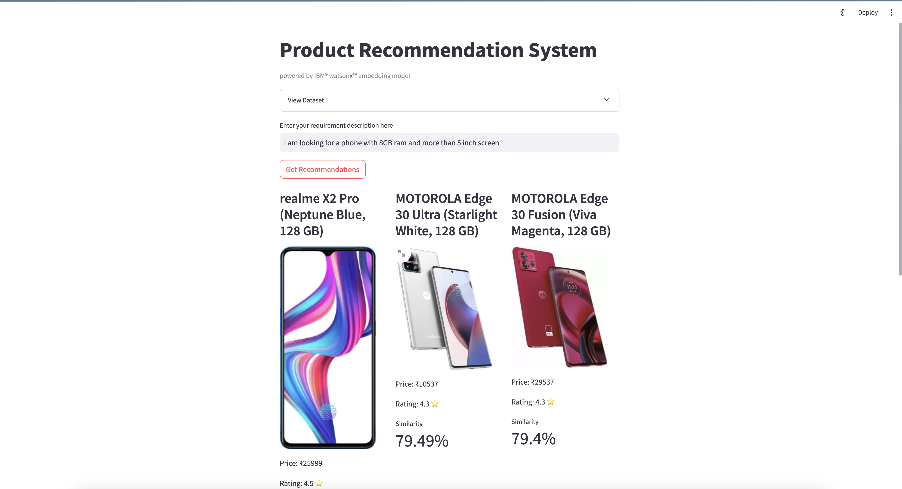

# product-recommendation

Product recommendation engine using watsonx embeddings

## Overview

This project is a product recommendation engine that uses IBM Watsonx.ai embeddings to provide personalized recommendations to users. The engine takes a user's requirement description as input and returns a list of products that are most similar to the user's requirement.

## Features

- **Data Loading**: The engine can load data from a CSV file.
- **Embedding Calculation**: It uses IBM Watsonx.ai embeddings to calculate the similarity between the user's requirement and the products in the dataset.
- **Recommendation Generation**: It generates a list of products that are most similar to the user's requirement.
- **Display**: It displays the recommendations in a grid layout with product images, prices, ratings, and similarity scores.

## Requirements

- **Python**: 3.8 or later
- **IBM Watsonx.ai**: The project uses IBM Watsonx.ai embeddings to calculate the similarity between the user's requirement and the products in the dataset.
- **Streamlit**: The project uses Streamlit to create the web app.

## Installation

1. Clone the repository:

    ```
    git clone https://github.com/manojjahgirdar/product-recommendation.git
    ```

2. Install the dependencies:

    ```
    pip install -r requirements.txt
    ```

3. export the following environment variables:

    ```
    export WATSONX_URL="your_watsonx_url" # example: https://us-south.ml.cloud.ibm.com
    export WATSONX_API_KEY="your_watsonx_api_key"
    export WATSONX_PROJECT_ID="your_watsonx_project_id"
    ```

## Usage

1. Run the Streamlit app:

    ```
    streamlit run app.py
    ```

2. Enter a requirement description and click "Get Recommendations" to see the list of products that are most similar to the user's requirement.

## Screenshots



## References

- Dataset: <https://www.kaggle.com/datasets/gyanprakashkushwaha/mobile-recommendation-system-dataset>
- Embeddings: <https://www.ibm.com/products/watsonx-ai/foundation-models>
- Streamlit: <https://docs.streamlit.io/>
